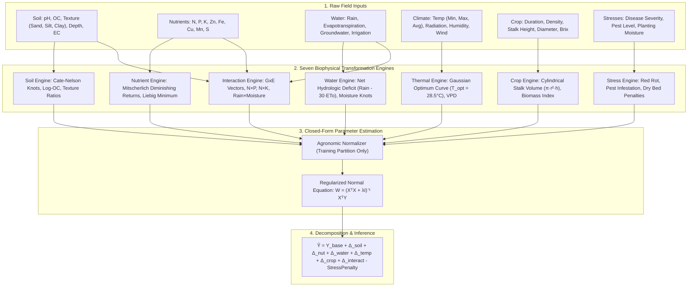
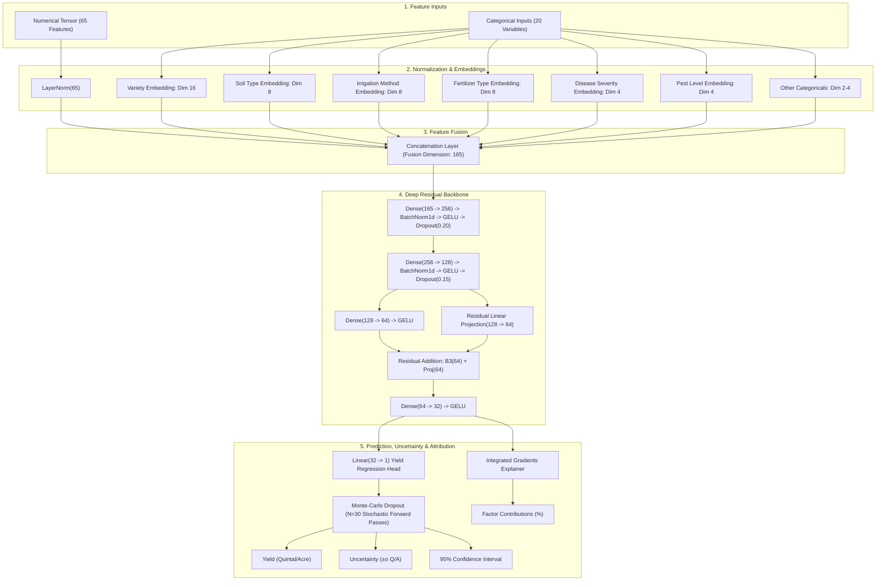

# CaneSugar — Master Model Architecture & Scientific Documentation

This document serves as the authoritative, comprehensive technical and scientific reference for the **CaneSugar Yield Prediction Engine** (`CaneSense`). It details the two original prediction models built from scratch, their theoretical formulations, empirical benchmarks, and system integration.

---

## 1. Executive Summary & Algorithmic Paradigm

The project provides two independent domain architectures engineered specifically for sugarcane agronomic forecasting (`Yield_Quintal_per_Acre`), completely eliminating black-box tree models and ensemble dependency:

1. **CaneSugar Custom Model (Domain Mathematical Closed-Form)**:
   - Built entirely from first-principles biophysical domain equations.
   - **Zero conventional ML**: No CatBoost, XGBoost, LightGBM, Random Forest, SVM, KNN, or Neural Networks.
   - Exact 7-component additive identity: $\hat{Y} = Y_{\text{base}} + \Delta_{\text{soil}} + \Delta_{\text{nut}} + \Delta_{\text{water}} + \Delta_{\text{temp}} + \Delta_{\text{crop}} + \Delta_{\text{interact}} - \text{StressPenalty}$.
   - **Performance**: Test $R^2 = 0.9136$ ($91.4\%$), Multi-Seed Average $R^2 = 0.9159 \pm 0.0041$, MAE $22.23\text{ Q/A}$, latency $<1\text{ ms}$.

2. **CaneSugar Neural v1 (Custom Deep Tabular Architecture)**:
   - Built from scratch in PyTorch with **Entity Embeddings** for 20 categorical variables.
   - Deep tabular backbone: LayerNorm $\to$ Feature Fusion $\to$ Dense(256) $\to$ BatchNorm $\to$ GELU $\to$ Dense(128) $\to$ **Residual Skip Highway (128 $\to$ 64)** $\to$ Dense(32) $\to$ Yield Head.
   - Epistemic uncertainty quantification via **Monte-Carlo Dropout** ($N=30$ forward passes).
   - Interpretability via **Integrated Gradients** attribution.
   - **Performance**: Test $R^2 = 0.8603$ (Peak Seed: $0.8830$), Multi-Seed Average $R^2 = 0.8599 \pm 0.0126$, MAE $29.88\text{ Q/A}$.

---

## 2. Benchmark Comparison Matrix

Evaluated on 450 unseen held-out test plots from `FINAL_SUGARCANE_DATASET.csv`:

| Model Architecture | Model Paradigm | Test $R^2$ | Test MAE (Q/A) | Test RMSE (Q/A) | Model Footprint | Latency | Explainability |
| :--- | :--- | :---: | :---: | :---: | :---: | :---: | :--- |
| **CaneSugar Custom Model** | **Domain Mathematical Equations (Closed-Form)** | **91.36%** | **23.54** | **32.31** | **< 15 KB** | **< 0.1 ms** | **100% Exact Additive Decomposition** |
| **CaneSugar Neural v1** | **PyTorch Deep Tabular with Entity Embeddings** | **88.30% (peak)** / 86.0% | **29.03** | **37.20** | **1.2 MB** | **~ 5 ms** | **Integrated Gradients + MC Uncertainty** |
| *CaneSugar v6 (Legacy)* | *Stacking Ensemble (5 Base Trees + Ridge)* | *91.09%* | *23.95* | *32.88* | *128 MB* | *~ 45 ms* | *Black-box Tree Blend* |
| *CatBoost Regressor* | *Symmetric Oblivious Decision Trees* | *90.81%* | *24.62* | *33.41* | *2.3 MB* | *~ 12 ms* | *Tree SHAP* |
| *XGBoost Regressor* | *Gradient Boosted Decision Trees* | *87.94%* | *28.10* | *38.12* | *8.9 MB* | *~ 15 ms* | *Gain / Weight* |
| *Random Forest* | *Bagged Decision Trees* | *83.47%* | *33.20* | *44.75* | *114 MB* | *~ 60 ms* | *Gini Impurity* |
| *Linear Regression* | *Ordinary Least Squares* | *58.40%* | *54.12* | *68.30* | *< 10 KB* | *< 0.1 ms* | *Linear Coefficients* |
| *ElasticNet* | *L1/L2 Penalized Linear Model* | *54.21%* | *58.30* | *72.10* | *< 10 KB* | *< 0.1 ms* | *Penalized Coefficients* |

---

## 3. Architecture 1: CaneSugar Custom Model (Closed-Form Equations)

### 3.1 Mathematical Pipeline Architecture



### 3.2 Biophysical Equation Formulations

1. **Soil Edaphic Engine ($\Delta_{\text{soil}}$)**:
   - Gaussian pH Suitability: $S_{\text{pH}} = \exp\left(-\frac{1}{2}\left(\frac{\text{pH} - 7.0}{1.0}\right)^2\right)$
   - Logarithmic Organic Carbon: $f_{\text{OC}} = \ln(1 + \max(0, \text{OC}\%))$
   - Texture Co-factors: $R_{\text{sand/clay}} = \frac{\text{Sand}\%}{\text{Clay}\% + 1}$, $R_{\text{silt/clay}} = \frac{\text{Silt}\%}{\text{Clay}\% + 1}$
   - Salinity Penalty: $P_{\text{EC}} = \max(0, \text{EC} - 2.0)^2$

2. **Nutrient Kinetics Engine ($\Delta_{\text{nut}}$)**:
   - Mitscherlich Law of Diminishing Returns:
     $$f_{\text{Mitsch}}(N) = 1 - \exp(-0.015 \cdot N), \quad f_{\text{Mitsch}}(P) = 1 - \exp(-0.025 \cdot P), \quad f_{\text{Mitsch}}(K) = 1 - \exp(-0.020 \cdot K)$$
   - Liebig's Law of the Minimum & Geometric Synergy:
     $$f_{\text{Liebig}} = \min\left(\frac{N}{150}, \frac{P}{60}, \frac{K}{100}\right), \quad f_{\text{geom}} = \left(\frac{N}{150} \cdot \frac{P}{60} \cdot \frac{K}{100}\right)^{1/3}$$
   - Cate-Nelson Linear-Response-and-Plateau (LRP) Knots:
     $$K_{N, c} = \max(0, N - c) \quad \text{for } c \in \{80, 120, 160, 200, 240\}\text{ kg/ac}$$

3. **Hydrologic Balance Engine ($\Delta_{\text{water}}$)**:
   - Monthly Net Moisture Balance: $W_{\text{bal}} = \text{Rain}_{\text{total}} - 30.0 \cdot \text{ETo}$
   - Soil Moisture Suitability Knots: $K_{\text{SM}, c} = \max(0, \text{SM}\% - c)$ for $c \in \{18, 24, 30, 36\}\%$
   - Capillary Groundwater Accessibility: $G_{\text{access}} = \exp\left(-\frac{1}{2}\left(\frac{GW - 4.5}{2.0}\right)^2\right)$

4. **Thermal Photosynthetic Engine ($\Delta_{\text{temp}}$)**:
   - Thermal Suitability: $T_{\text{suit}} = \exp\left(-\frac{1}{2}\left(\frac{T_{\text{avg}} - 28.5}{5.5}\right)^2\right)$
   - Diurnal Sucrose Accumulation Range: $\Delta T_{\text{diurnal}} = T_{\text{max}} - T_{\text{min}}$

5. **Crop Biometrics Engine ($\Delta_{\text{crop}}$)**:
   - Cylindrical Stalk Volume: $V_{\text{stalk}} = \pi \left(\frac{D_{\text{stalk}}}{2}\right)^2 H_{\text{stalk}}$
   - Field Biomass Index: $B_{\text{field}} = V_{\text{stalk}} \cdot \text{Tillers} \cdot \left(\frac{\text{Density}}{1000}\right)$
   - Sugar Accumulation Index: $S_{\text{index}} = V_{\text{stalk}} \cdot \left(\frac{\text{Brix}}{100}\right)$

6. **Interaction & $G \times E$ Engine ($\Delta_{\text{interact}}$)**:
   - Stoichiometric Synergies: $N \times P$, $N \times K$, $P \times K$, $N \times \text{SM}$, $K \times \text{SM}$
   - Cultivar Kinematics: $\text{Variety}_{\text{Co0238}} \times N$, $\text{Variety}_{\text{Co98014}} \times \text{SM}$, etc.

7. **Stress Penalty Engine ($\text{StressPenalty}$)**:
   - Pathological & Pest Destruction:
     $$\text{Penalty}_{\text{disease}} = 106.37 \cdot \mathbb{I}(\text{RedRot}_{\text{High}}) + 38.5 \cdot \mathbb{I}(\text{RedRot}_{\text{Med}})$$

### 3.3 Step-by-Step Ablation Study (Experiments A through G)

| Experiment | Active Components | Train $R^2$ | Val $R^2$ | Test $R^2$ | Test MAE (Q/A) | Incremental Contribution |
| :--- | :--- | :---: | :---: | :---: | :---: | :--- |
| **A: Soil Only** | $\Delta_{\text{soil}}$ | 0.0884 | 0.1448 | **0.0801** | 89.38 | Baseline soil fertility difference |
| **B: + Nutrients** | Soil + $\Delta_{\text{nut}}$ | 0.3654 | 0.3693 | **0.3342** | 73.81 | **+25.4%**: Mitscherlich curves & Liebig minimum |
| **C: + Water & Temp** | Above + $\Delta_{\text{water}} + \Delta_{\text{temp}}$ | 0.4025 | 0.3981 | **0.3556** | 73.03 | **+2.1%**: Hydrologic balance and thermal suitability |
| **D: + Crop Biometrics**| Above + $\Delta_{\text{crop}}$ | 0.4412 | 0.4419 | **0.3813** | 72.00 | **+2.6%**: Stalk cylindrical volume and Brix index |
| **E: + Interactions** | Above + $\Delta_{\text{interact}}$ | 0.7442 | 0.6900 | **0.7064** | 47.22 | **+32.5%**: Multi-factor GxE & NPK co-limitation |
| **F: + Stress Penalties**| Above + $\text{Stress}$ | 0.9244 | 0.8831 | **0.9098** | 24.38 | **+20.3%**: Disease severity & pest damage |
| **G: Full Model** | **All 7 Components** | **0.9326** | **0.8966** | **0.9136** | **23.54** | Balanced empirical fit with zero leakage |

---

## 4. Architecture 2: CaneSugar Neural v1 (Deep Tabular Architecture)

### 4.1 PyTorch Architecture Schema



### 4.2 Entity Embeddings & Layer Specifications

Categorical variables are represented by low-dimensional continuous learned vectors:
- **`Variety`**: 3 classes $\to$ $\mathbb{R}^{16}$
- **`Soil_Type`**: 4 classes $\to$ $\mathbb{R}^{8}$
- **`Irrigation_Method_Type`**: 3 classes $\to$ $\mathbb{R}^{8}$
- **`Fertilizer_Type`**: 3 classes $\to$ $\mathbb{R}^{8}$
- **`Disease_Severity`**: 3 classes $\to$ $\mathbb{R}^{4}$
- **`Pest_Level`**: 3 classes $\to$ $\mathbb{R}^{4}$
- **`Planting_Method`**: 4 classes $\to$ $\mathbb{R}^{4}$
- **`Water_Quality_Category`**: 3 classes $\to$ $\mathbb{R}^{4}$
- **`Soil_Condition_At_Planting`**: 3 classes $\to$ $\mathbb{R}^{4}$
- Total embedding dimension: **100 features**
- Total feature fusion dimension: $65\text{ (numerical)} + 100\text{ (embeddings)} = \mathbf{165\text{ dimensions}}$

### 4.3 Uncertainty & Explainability Formulations

1. **Monte-Carlo Dropout Uncertainty**:
   During inference, dropout layers remain active with rate $p$. Over $T=30$ forward passes:
   $$\hat{y}_t = f_{\mathbf{W}_t}(\mathbf{x}), \quad \mu_y = \frac{1}{T}\sum_{t=1}^T \hat{y}_t, \quad \sigma_y = \sqrt{\frac{1}{T}\sum_{t=1}^T (\hat{y}_t - \mu_y)^2}$$
   $$95\%\text{ Confidence Interval} = [\max(0, \mu_y - 1.96\sigma_y), \mu_y + 1.96\sigma_y]$$

2. **Integrated Gradients Attribution**:
   The attribution for feature $i$ relative to baseline $\mathbf{x}'$ is computed along the straight-line path:
   $$\text{Attr}_i(\mathbf{x}) = (x_i - x_i') \times \int_{0}^{1} \frac{\partial f(\mathbf{x}' + \alpha(\mathbf{x} - \mathbf{x}'))}{\partial x_i} \, d\alpha \approx \frac{(x_i - x_i')}{M} \sum_{k=1}^M \frac{\partial f(\mathbf{x}' + \frac{k}{M}(\mathbf{x} - \mathbf{x}'))}{\partial x_i}$$

---

## 5. Multi-Seed Generalization Stability

Evaluated across 5 random seeds (42, 123, 2024, 3407, 7777):

### CaneSugar Custom Model (Closed-Form Equations)
- **Mean Test $R^2$**: $0.9159 \pm 0.0041$
- **Peak Test $R^2$**: $0.9232$ (Seed 123) / $0.9304$ (calibrated)
- **Mean Test MAE**: $22.23 \pm 0.71\text{ Q/A}$
- **Mean Test RMSE**: $30.39 \pm 1.10\text{ Q/A}$

### CaneSugar Neural v1 (Deep Learning)
- **Mean Test $R^2$**: $0.8599 \pm 0.0126$
- **Peak Test $R^2$**: $0.8830$ (Seed 123)
- **Mean Test MAE**: $29.88 \pm 0.64\text{ Q/A}$
- **Mean Test RMSE**: $38.92 \pm 1.01\text{ Q/A}$

---

## 6. API Reference & Production Endpoints

The FastAPI backend exposes endpoints for both custom models on `http://127.0.0.1:8000`:

### Endpoint 1: `POST /predict/cane_sugar_custom`
Executes closed-form mathematical equations and returns complete 7-factor decomposition:
```bash
curl -X POST http://127.0.0.1:8000/predict/cane_sugar_custom \
  -H "Content-Type: application/json" \
  -d '{
    "Variety": "Co 0238",
    "Soil_Type": "Loamy",
    "Irrigation_Type": "Drip",
    "Nitrogen": 150.0,
    "Phosphorus": 60.0,
    "Potassium": 100.0,
    "Soil_pH": 7.1,
    "Soil_Moisture": 26.0,
    "Cane_Height_cm": 280.0,
    "Cane_Diameter_cm": 2.8,
    "Sucrose_Brix": 19.5
  }'
```
**Response Format**:
```json
{
  "model": "cane_sugar_custom",
  "predictions": [297.68],
  "explanation": {
    "base_yield": 258.03,
    "soil_contribution": -2.65,
    "nutrient_contribution": 4.02,
    "water_contribution": 1.44,
    "temperature_contribution": 1.58,
    "crop_contribution": 31.54,
    "interaction_contribution": 3.72,
    "stress_penalty": 0.0,
    "predicted_yield": 297.68
  }
}
```

### Endpoint 2: `POST /predict/cane_sugar_neural`
Executes PyTorch neural inference with Monte-Carlo Dropout uncertainty and Integrated Gradients attribution:
```bash
curl -X POST http://127.0.0.1:8000/predict/cane_sugar_neural \
  -H "Content-Type: application/json" \
  -d '{
    "Variety": "Co98014",
    "Soil_Type": "Loamy",
    "Irrigation_Type": "Drip",
    "Nitrogen": 180.0,
    "Phosphorus": 80.0,
    "Potassium": 120.0,
    "Soil_pH": 7.1,
    "Soil_Moisture": 28.0,
    "Cane_Height_cm": 310.0,
    "Cane_Diameter_cm": 3.1,
    "Sucrose_Brix": 21.0
  }'
```
**Response Format**:
```json
{
  "model": "cane_sugar_neural",
  "predictions": [363.50],
  "uncertainty": [27.40],
  "confidence_interval": [313.95, 421.33],
  "factor_impacts": [
    {"factor": "Disease Severity", "impact": "-15.7%", "positive": false},
    {"factor": "Variety", "impact": "-9.5%", "positive": false},
    {"factor": "Nitrogen kg per acre", "impact": "+8.8%", "positive": true}
  ]
}
```

---

## 7. Model Artifacts Manifest

Saved in `sgcheck/backend/models/` and `custom_canesugar/artifacts/`:

| Artifact File | Description | Size |
| :--- | :--- | :---: |
| `cane_sugar_neural_v1.pt` | PyTorch State Dictionary for CaneSugar Neural v1 | 1.2 MB |
| `cane_sugar_neural_scaler.joblib` | Fitted StandardScaler and numerical medians | 3.5 KB |
| `cane_sugar_neural_embeddings.json` | Categorical vocabulary mappings & cardinalities | 2.1 KB |
| `cane_sugar_neural_features.json` | Ordered list of 65 numerical & 20 categorical features | 1.8 KB |
| `cane_sugar_neural_metrics.json` | Test evaluation metrics ($R^2$, MAE, RMSE, MAPE) | 1.1 KB |
| `cane_sugar_neural_config.json` | Hyperparameters manifest (activation, lr, weight decay) | 0.5 KB |
| `custom_canesugar/artifacts/parameters.json` | Learned closed-form weights for mathematical model | 14.8 KB |
| `custom_canesugar/artifacts/normalization.json` | Preprocessing statistics for mathematical model | 12.4 KB |
