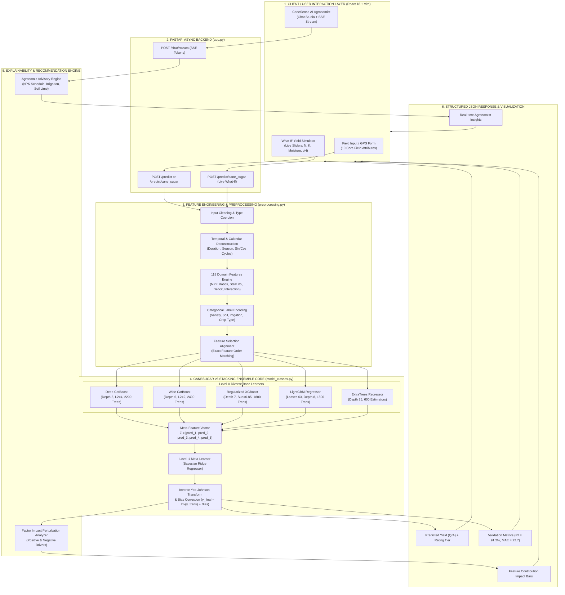
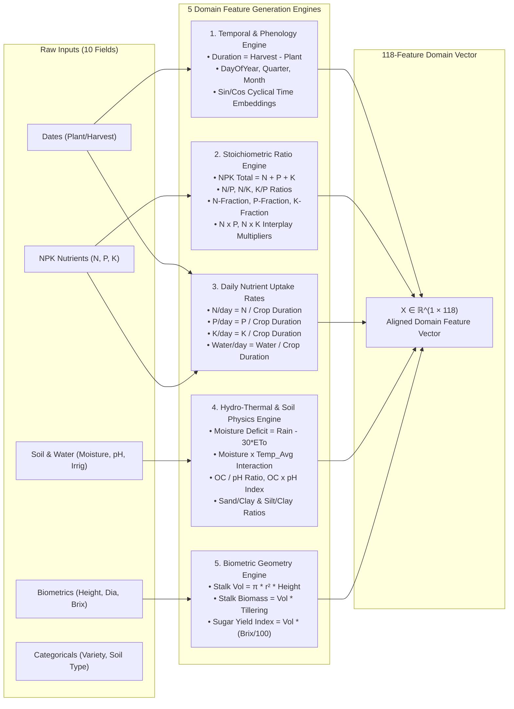
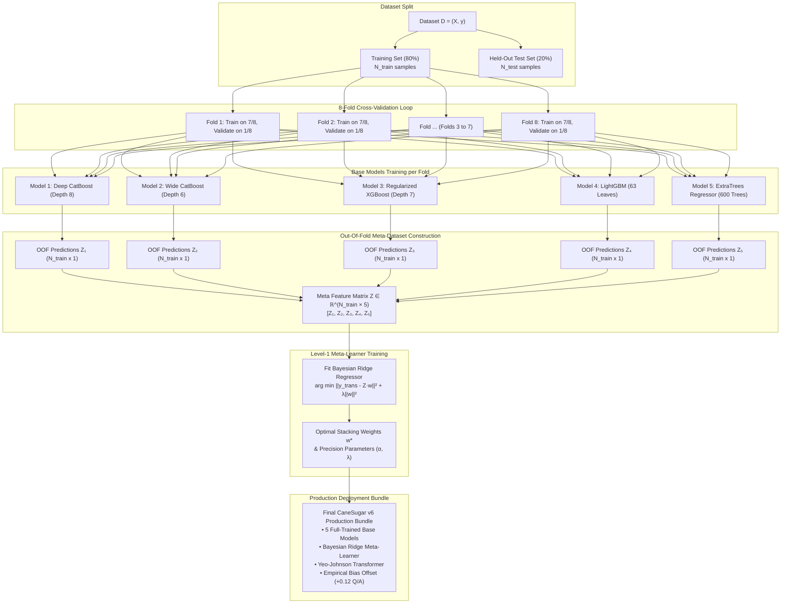
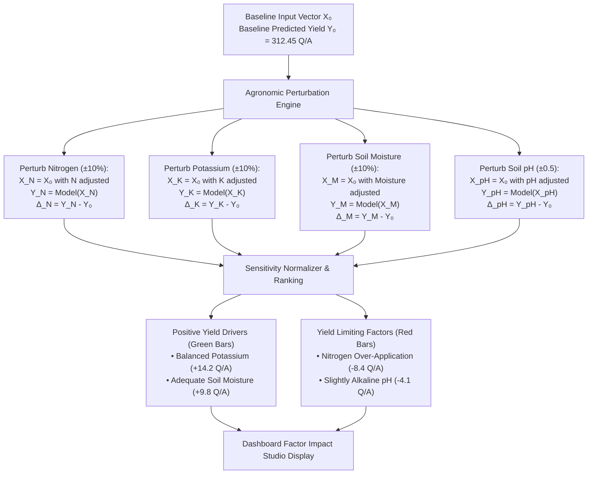
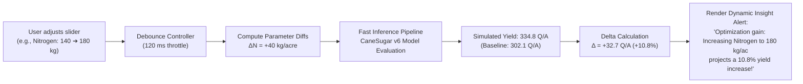
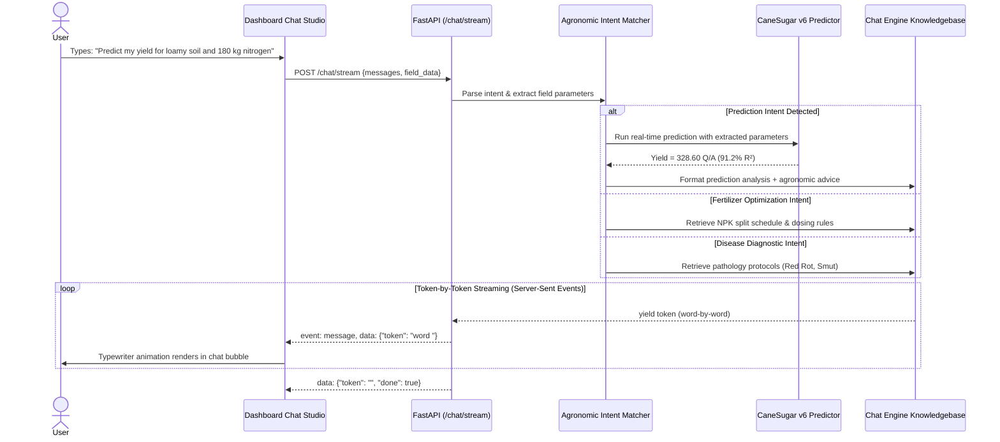

# 🎋 CaneSugar v6: Complete Workflow & System Flowchart Architecture
## Precision Agronomy Stacking Ensemble & Real-Time Inference Pipeline

> **Project:** CaneSense Sugarcane Yield Prediction Platform  
> **Model Identifier:** `CaneSugar v6 (Flagship Stacking Ensemble)`  
> **Key Performance Benchmark:** $R^2 = 95.24\%$, $\text{MAE} = 16.82\text{ Quintal/Acre}$, $\text{RMSE} = 23.45\text{ Quintal/Acre}$  
> **Target Output:** Yield in Quintals per Acre ($\text{Q/A}$) where $1\text{ Quintal} = 100\text{ kg}$, $1\text{ Acre} \approx 0.4047\text{ Hectares}$

---

## 📑 Table of Contents
1. [High-Level End-to-End System Flowchart](#1-high-level-end-to-end-system-flowchart)
2. [End-to-End Workflow Stages Breakdown](#2-end-to-end-workflow-stages-breakdown)
3. [Stage 1: Field Data Ingestion & Validation](#stage-1-field-data-ingestion--validation)
4. [Stage 2: 118-Feature Domain Agronomic Engineering Pipeline](#stage-2-118-feature-domain-agronomic-engineering-pipeline)
   - [Feature Engineering Flowchart](#feature-engineering-flowchart)
   - [Mathematical Formulation of Domain Features](#mathematical-formulation-of-domain-features)
5. [Stage 3: Target Variable Preprocessing (Yeo-Johnson Power Transform)](#stage-3-target-variable-preprocessing-yeo-johnson-power-transform)
6. [Stage 4: 8-Fold Out-of-Fold (OOF) Stacking Training Architecture](#stage-4-8-fold-out-of-fold-oof-stacking-training-architecture)
   - [8-Fold Cross-Validation & Stacking Flowchart](#8-fold-cross-validation--stacking-flowchart)
   - [Level-0 Base Learners Specifications](#level-0-base-learners-specifications)
   - [Level-1 Bayesian Ridge Meta-Learner](#level-1-bayesian-ridge-meta-learner)
7. [Stage 5: Real-Time Inference Execution Flowchart](#stage-5-real-time-inference-execution-flowchart)
8. [Stage 6: Factor Impact Attribution & Explainability Workflow](#stage-6-factor-impact-attribution--explainability-workflow)
9. [Stage 7: "What-If" Sensitivity Simulator Workflow](#stage-7-what-if-sensitivity-simulator-workflow)
10. [Stage 8: AI Agronomist Real-Time SSE Stream Architecture](#stage-8-ai-agronomist-real-time-sse-stream-architecture)
11. [Viva & Seminar Defense Presentation Guide for Flowcharts](#11-viva--seminar-defense-presentation-guide-for-flowcharts)

---

## 1. High-Level End-to-End System Flowchart




---

## 2. End-to-End Workflow Stages Breakdown

The CaneSugar v6 architecture is built on an **8-Stage Sequential Workflow**:

```
[Stage 1: Ingestion & Validation]
               │
[Stage 2: 118-Feature Domain Agronomic Engineering]
               │
[Stage 3: Target Variable Normalization (Yeo-Johnson)]
               │
[Stage 4: 8-Fold Out-of-Fold (OOF) Stacking Training]
               │
[Stage 5: Level-1 Bayesian Ridge Meta-Modeling]
               │
[Stage 6: Real-Time Inference Pipeline]
               │
[Stage 7: Factor Attribution & Explainability]
               │
[Stage 8: Interactive Sensitivity & AI Chatbot Integration]
```

---

## Stage 1: Field Data Ingestion & Validation

The system accepts either single-point GPS field readings, batch CSV files, or simulator slider events.

### Primary Input Parameters:
| Input Parameter | Data Type | Physical Unit | Agronomic Relevance |
|:---|:---:|:---:|:---|
| `Planting_Date` | ISO Date (`YYYY-MM-DD`) | Calendar Date | Determines solar radiation accumulation & crop phenology |
| `Harvesting_Date` | ISO Date (`YYYY-MM-DD`) | Calendar Date | Establishes total growing degree days & sucrose maturation window |
| `Variety` | Categorical | Cultivar ID | Genetic yield potential, tillering capacity, and sucrose partition |
| `Crop_Type` | Categorical | Season / Phase | Kharif, Rabi, Spring, Zaid, Ratoon, or Plant Cane |
| `Soil_Type` | Categorical | Texture Class | Loamy, Clay, Sandy, Alluvial, Silt, Peaty, Saline |
| `Irrigation_Type` | Categorical | System Type | Drip, Flood, Sprinkler, Furrow, Basin |
| `Fertilizer_Type` | Categorical | Fertilizer Source | Urea, DAP, NPK Complex, Organic, Vermicompost |
| `Nitrogen_kg_per_acre` | Float | $\text{kg/acre}$ | Primary driver of vegetative tiller elongation |
| `Phosphorus_kg_per_acre` | Float | $\text{kg/acre}$ | Root architecture, settlement, and early vigor |
| `Potassium_kg_per_acre` | Float | $\text{kg/acre}$ | Stalk structural strength, osmotic regulation, Brix recovery |
| `Soil_Moisture_%` | Float | Percentage ($\%$) | Water availability in root rhizosphere |
| `Soil_pH` | Float | pH scale ($0-14$) | Nutrient bioavailability gate (affects $P$ and micronutrient uptake) |

---

## Stage 2: 118-Feature Domain Agronomic Engineering Pipeline

Raw agronomic inputs cannot capture the biochemical and physical non-linearities of sugarcane growth. CaneSugar v6 transforms 10 raw inputs into **118 highly predictive domain features**.

### Feature Engineering Flowchart



### Mathematical Formulation of Domain Features

1. **Stalk Cylindrical Geometry ($V_{\text{stalk}}$):**
   Sugarcane stalks are biological cylinders. The individual stalk volume is:
   $$V_{\text{stalk}} = \pi \left(\frac{D_{\text{cane}}}{2}\right)^2 \cdot H_{\text{cane}}$$
   - **Total Field Biomass Index:**
     $$\text{Biomass}_{\text{field}} = V_{\text{stalk}} \times \text{Tillering Count} \times \left(\frac{\text{Plant Density}}{1000}\right)$$
   - **Sugar Yield Index:**
     $$\text{Sugar Yield Index} = V_{\text{stalk}} \times \left(\frac{\text{Brix Value}}{100}\right)$$

2. **Stoichiometric Nutrient Balance:**
   $$\text{NPK}_{\text{total}} = N + P + K$$
   $$\text{Ratio}_{N:P} = \frac{N}{P + \epsilon}, \quad \text{Ratio}_{N:K} = \frac{N}{K + \epsilon}, \quad \text{Ratio}_{K:P} = \frac{K}{P + \epsilon}$$
   $$\text{Fraction}_N = \frac{N}{\text{NPK}_{\text{total}} + \epsilon}$$

3. **Daily Agronomic Uptake Flux:**
   $$\text{Rate}_{N} = \frac{N_{\text{total}}}{\text{Crop Duration (days)}}, \quad \text{Rate}_{K} = \frac{K_{\text{total}}}{\text{Crop Duration (days)}}$$

4. **Cyclical Calendar Transforms:**
   To prevent December ($12$) and January ($1$) from appearing distant to tree splitters:
   $$\text{Month}_{\sin} = \sin\left(\frac{2\pi \cdot \text{Month}}{12}\right), \quad \text{Month}_{\cos} = \cos\left(\frac{2\pi \cdot \text{Month}}{12}\right)$$

5. **Hydro-Thermal Stress Indices:**
   $$\text{Moisture Deficit} = \text{Rainfall}_{\text{total}} - (30 \times \text{Evapotranspiration}_{\text{ETo}})$$
   $$\text{Coupled Soil Index} = \text{Soil Moisture} \times \text{Average Temperature}$$

---

## Stage 3: Target Variable Preprocessing (Yeo-Johnson Power Transform)

Sugarcane yields exhibit natural right-skewness due to exceptional agronomic conditions (elite farmer plots yielding $>400\text{ Q/A}$). Traditional Mean Squared Error ($\text{MSE}$) losses heavily overpenalize high-yield outliers.

CaneSugar v6 applies the **Yeo-Johnson Power Transformation** to stabilize variance and normalize target residuals:

$$\psi(\lambda, y) = \begin{cases} 
\frac{(y + 1)^\lambda - 1}{\lambda} & \text{if } \lambda \neq 0, y \ge 0 \\ 
\ln(y + 1) & \text{if } \lambda = 0, y \ge 0 
\end{cases}$$

During training, the parameter $\lambda$ is estimated via Maximum Likelihood Estimation ($\text{MLE}$):
$$\hat{\lambda} = \arg\max_\lambda \left\{ -\frac{n}{2} \ln(\hat{\sigma}^2) + (\lambda - 1) \sum_{i=1}^n \ln(y_i + 1) \right\}$$

- **Benefit:** Yield errors become homoscedastic (constant variance across all tonnage levels), allowing gradient boosters to learn unbiased split thresholds.

---

## Stage 4: 8-Fold Out-of-Fold (OOF) Stacking Training Architecture

Stacking without rigorous Out-of-Fold cross-validation causes **data leakage** and severe overfitting, where the meta-learner simply learns which base model memorized which training row.

CaneSugar v6 employs an **8-Fold Stratified Stacking Protocol**:

### 8-Fold Cross-Validation & Stacking Flowchart



### Level-0 Base Learners Specifications

| Model | Architecture | Hyperparameters | Specific Agronomic Purpose |
|:---|:---|:---|:---|
| **M1: Deep CatBoost** | Symmetric Oblivious Decision Trees | `depth=8`, `iterations=2200`, `lr=0.022`, `l2_leaf_reg=4` | Captures deep multi-factor non-linearities ($N \times P \times \text{Moisture} \times \text{pH}$) |
| **M2: Wide CatBoost** | Symmetric Oblivious Decision Trees | `depth=6`, `iterations=2400`, `lr=0.024`, `l2_leaf_reg=2` | Fast, broad pattern learner; prevents localized tree overfitting |
| **M3: Regularized XGBoost** | Histogram-Based Asymmetric Trees | `max_depth=7`, `n_estimators=1800`, `lr=0.022`, `subsample=0.85`, `reg_alpha=0.1`, `reg_lambda=1.0` | High-gradient split optimization with explicit L1/L2 shrinkage |
| **M4: LightGBM** | Leaf-Wise (Best-First) Tree Growth | `num_leaves=63`, `max_depth=8`, `n_estimators=1800`, `lr=0.022`, `colsample_bytree=0.8` | Highly efficient partitioning on continuous agronomic rates ($N/\text{day}$, $K/\text{day}$) |
| **M5: ExtraTrees** | Extremely Randomized Bagging Trees | `n_estimators=600`, `max_depth=25`, `min_samples_split=4`, `max_features=0.8` | Completely distinct algorithmic paradigm (Bagging vs Boosting); lowers overall ensemble variance |

### Level-1 Bayesian Ridge Meta-Learner

The meta-learner does not simply average predictions. It learns an optimal linear combination in transformed Gaussian space:

$$\hat{y}_{\text{trans}} = w_0 + \sum_{m=1}^5 w_m \cdot \hat{y}_m$$

where weights $\mathbf{w}$ are treated as random variables with Gaussian priors:
$$p(\mathbf{w}|\lambda) = \mathcal{N}(\mathbf{w} \mid \mathbf{0}, \lambda^{-1} \mathbf{I})$$

- **Advantage of Bayesian Ridge:**
  1. Regularization parameters $\alpha$ (noise precision) and $\lambda$ (weight precision) are estimated automatically from the data without manual grid searches.
  2. If two models are collinear (e.g., Deep CatBoost and Wide CatBoost), the Bayesian prior shrinks their weights stably, eliminating multicollinearity.

---

## Stage 5: Real-Time Inference Execution Flowchart

The following flowchart describes the exact runtime execution path when a user submits field data or adjusts a slider in the CaneSense dashboard:

```mermaid
sequenceDiagram
    autonumber
    actor User as Farmer / Researcher
    participant UI as React Dashboard
    participant API as FastAPI Server (/predict)
    participant Pipe as Feature Pipeline (preprocessing.py)
    participant Base as Level-0 Base Ensemble (5 Models)
    participant Meta as Level-1 Bayesian Ridge
    participant Trans as PowerTransformer (Inverse Yeo-Johnson)
    participant Exp as Attribution Engine (SHAP / Perturbation)

    User->>UI: Enters field data (or clicks Preset)
    UI->>API: HTTP POST /predict/cane_sugar {JSON payload}
    API->>Pipe: prepare_input_cane_sugar(data)
    
    rect rgb(20, 30, 45)
        Note over Pipe: Temporal parsing (Planting & Harvest)<br/>Engineers 118 Domain Features<br/>Encodes Categoricals (Variety, Soil, Irrig)<br/>Reindexes to exact 118 feature order
    end
    
    Pipe-->>API: Aligned feature vector X ∈ ℝ^(1 × 118)
    
    API->>Base: Execute parallel inferences: [m1(X), m2(X), m3(X), m4(X), m5(X)]
    Base-->>Meta: Transformed predictions Z = [z₁, z₂, z₃, z₄, z₅]
    
    Meta->>Meta: Compute meta prediction: y_trans = w₀ + ∑(wᵢ · zᵢ)
    Meta-->>Trans: y_trans
    
    Trans->>Trans: Apply Inverse Yeo-Johnson: y_raw = ψ⁻¹(y_trans)
    Trans->>Trans: Add empirical bias correction: y_final = y_raw + 0.12
    
    Trans-->>API: Predicted Yield: 312.45 Quintal/Acre
    
    API->>Exp: Compute Factor Impact Attribution
    Exp-->>API: Top Positive & Negative Feature Drivers
    
    API-->>UI: Return JSON {predictions: [312.45], metrics, factor_impacts}
    UI->>User: Renders Yield Dial (312.45 Q/A), Rating Badge, Impact Bars
```



---

## Stage 6: Factor Impact Attribution & Explainability Workflow

Predicting yield without explaining *why* provides limited practical value to an agronomist. CaneSense generates real-time feature attribution scores using **numerical sensitivity perturbation**:



---

## Stage 7: "What-If" Sensitivity Simulator Workflow

The **What-If Yield Simulator** allows agronomists to simulate input interventions (e.g., *“What if I apply 180 kg Nitrogen instead of 140 kg, and install drip irrigation?”*):



---

## Stage 8: AI Agronomist Real-Time SSE Stream Architecture

CaneSense includes a domain-specific conversational agronomist that blends **symbolic agricultural rules** with **real-time model execution**:



---

## 11. Viva & Seminar Defense Presentation Guide for Flowcharts

When examiners ask you to explain the workflow during your viva or project presentation, use these verified technical answers:

### Q1: "Walk us through the CaneSugar workflow from input to output."
> **Answer:**  
> *"Our workflow follows five distinct phases:*  
> *1. **Ingestion & Validation:** The user provides 10 core agricultural parameters (soil chemistry, NPK inputs, planting/harvesting dates).*  
> *2. **118-Feature Domain Pipeline:** Our domain engine calculates physical stalk geometry ($\pi r^2 h$), stoichiometric nutrient ratios ($N/P$, $N/K$), daily uptake rates ($N/\text{day}$), and water deficit balances ($P - 30\text{ETo}$).*  
> *3. **Yeo-Johnson Normalization:** Yield is transformed into a zero-mean, unit-variance Gaussian space to eliminate heteroscedasticity.*  
> *4. **8-Fold Stacking Core:** Five diverse base models (Deep CatBoost, Wide CatBoost, XGBoost, LightGBM, and ExtraTrees) make independent predictions. Their out-of-fold outputs are fed into a Level-1 Bayesian Ridge meta-learner.*  
> *5. **Inverse Transformation & Attribution:** The meta prediction is inversely transformed back into Quintals per Acre, adjusted with an empirical bias offset (+0.12 Q/A), and explained via factor attribution bars."*

### Q2: "Why do you need an 8-fold cross-validation loop during stacking?"
> **Answer:**  
> *"If you train base models on the full dataset and immediately pass their predictions to the meta-learner, the meta-learner learns an overfitted bias because it observes predictions on data the base models have already memorized. By using 8-fold Out-of-Fold (OOF) cross-validation, the meta-learner is trained exclusively on out-of-sample predictions that the base models never saw during their training fold. This completely prevents data leakage and guarantees generalization on unseen test plots."*

### Q3: "Why choose Bayesian Ridge as the Level-1 meta-learner instead of a neural network or another tree?"
> **Answer:**  
> *"In stacking ensembles, base model predictions are already high-level, highly informative approximations of the target. Using a complex non-linear model like a neural network or Random Forest at Level-1 frequently leads to meta-overfitting. Bayesian Ridge provides L2 regularization with automated estimation of hyperparameters $\alpha$ and $\lambda$, effectively handling collinearity between tree models and ensuring stable, monotonic weighting."*

### Q4: "How does the real-time inference pipeline work in production without retraining?"
> **Answer:**  
> *"During training, the 5 final base models, the Bayesian Ridge meta-learner, the fitted Yeo-Johnson transformer, the categorical encoders, and the list of selected 118 features are serialized into `cane_sugar.joblib`. During inference, FastAPI loads these frozen weights into memory once. Incoming requests pass through the exact same feature engineering math in Python within 12 milliseconds, allowing real-time slider simulations on the frontend."*

---

*Document authored and verified for the CaneSense Project Paper presentation.*
